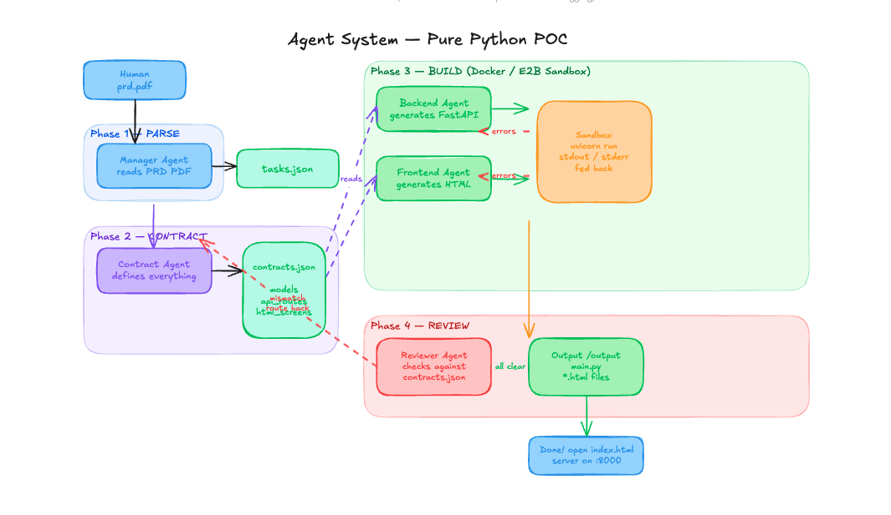

# AltimateAI — Software Agency

An agentic pipeline that turns a Product Requirements Document (PRD) into a
running full-stack web application. Give it a PDF, get back a live app.

---

## How it works



```
PRD (PDF or text)
    │
    ▼
┌─────────────────┐
│  Manager Agent  │  Reads PRD → structured Markdown project plan
└────────┬────────┘
         │ plan
         ▼
┌──────────────────────┐
│  Contract Architect  │  design_contract.json + data_contract.json
└──────────┬───────────┘
           │
     ┌─────┴──────┐
     ▼            ▼
┌──────────┐  ┌─────────────────┐
│ UI Design│  │  Backend Agent  │  FastAPI + SQLModel + SQLite
│  Agent   │  └─────────────────┘
└────┬─────┘
     │ ui/index.html
     ▼
┌───────────────────┐
│ Frontend Developer│  frontend/main.js — fetch + DOM wiring
└────────┬──────────┘
         │
         ▼
┌──────────────────┐
│  Reviewer Agent  │  Checks all artefacts against contracts (up to 3 fix rounds)
└──────────────────┘
         │
         ▼
  Docker containers
  backend  → http://localhost:5000
  frontend → http://localhost:3000
```

### Contracts

The two contracts are the shared source of truth between all agents.

**`design_contract.json`** — drives UI and frontend:
- `theme` — hex colour palette
- `typography` — font family + base size
- `screens[]` — name, route, description, features list

**`data_contract.json`** — drives backend and frontend API calls:
- `models[]` — SQLModel/Pydantic field definitions
- `endpoints[]` — method, path, request/response shapes, pagination flag

---

## Project structure

```
altimateai/
├── src/
│   ├── main.py              # Entry point: runs agency then starts Docker containers
│   ├── config.py            # LLM config, Docker constants, Dockerfile templates
│   └── agents/
│       ├── agents.py        # SoftwareAgency class + run_agency() convenience wrapper
│       ├── utils.py         # Helpers: file parsing, contract repair, static checks
│       └── prompts/
│           ├── manager.py
│           ├── contract.py
│           ├── ui_designer.py
│           ├── frontend.py
│           ├── backend.py
│           └── reviewer.py
├── src/tools/
│   ├── pdf_reader.py        # extract_text, extract_pages, extract_metadata, extract_images
│   ├── file_writer.py       # write_text, write_json, write_csv, write_bytes, append_text
│   └── screenshot.py        # screenshot_url, screenshot_element, screenshot_html
├── samples/                 # Sample PRD files
├── tests/
├── workspaces/              # Generated output (gitignored)
│   └── output/
│       ├── plan.md
│       ├── contracts/
│       │   ├── design_contract.json
│       │   └── data_contract.json
│       ├── ui/              # Static HTML from UI Designer
│       ├── frontend/        # index.html + main.js (served by nginx)
│       └── backend/         # FastAPI app (hot-reload via volume mount)
├── pyproject.toml
└── CLAUDE.md
```

---

## Quickstart

### 1. Install dependencies

```bash
uv sync
uv run playwright install chromium
```

### 2. Configure environment

Create a `.env` file in the project root:

```env
# Use Anthropic Claude (default)
ANTHROPIC_API_KEY=sk-ant-...
MODEL_CONFIG=cloud

# Or use a local Ollama model
# MODEL_CONFIG=local
```

### 3. Run

```bash
# Generate + deploy from a PDF PRD
uv run python -m src.main samples/TodoPRD.pdf

# Custom output directory
uv run python -m src.main samples/TodoPRD.pdf workspaces/my_project

# Stop running containers
uv run python -m src.main stop
```

The pipeline generates all code, builds Docker images, and opens:
- **Frontend** — http://localhost:3000
- **Backend API** — http://localhost:5000/docs

---

## Agent responsibilities

| Agent | Input | Output |
|---|---|---|
| Manager | Raw PRD text | `plan.md` — Markdown task breakdown |
| Contract Architect | plan.md | `design_contract.json` + `data_contract.json` |
| UI Designer | design_contract | `ui/index.html` — static Tailwind HTML, no JS |
| Frontend Developer | design_contract + HTML + data_contract | `frontend/main.js` — fetch + DOM wiring |
| Backend Developer | data_contract | `backend/main.py` — single-file FastAPI app |
| Reviewer | all artefacts + contracts | JSON report; triggers fix rounds for failing components |

---

## Reliability features

- **Contract JSON repair** — strict parse → `json_repair` → dedicated LLM repair agent (3 retries)
- **Static checks before review** — `py_compile` + pattern grep for `model_dict`, missing CORS, and `node --check` for JS syntax errors, SCREENS prefix bugs, functions inside the boot IIFE
- **Review loop** — reviewer gets all static errors injected; `pass` field is recomputed from component `ok` flags, never trusted from the LLM
- **Template-based generation** — agents fill marked zones in pre-written file skeletons rather than generating from scratch, reducing hallucination

---

## Dependencies

| Package | Purpose |
|---|---|
| `crewai[anthropic,litellm]` | Agent orchestration |
| `pymupdf` | PDF text extraction |
| `playwright` | Headless browser screenshots |
| `json-repair` | Programmatic JSON repair before LLM fallback |
| `docker` | Build and run containers from Python |
